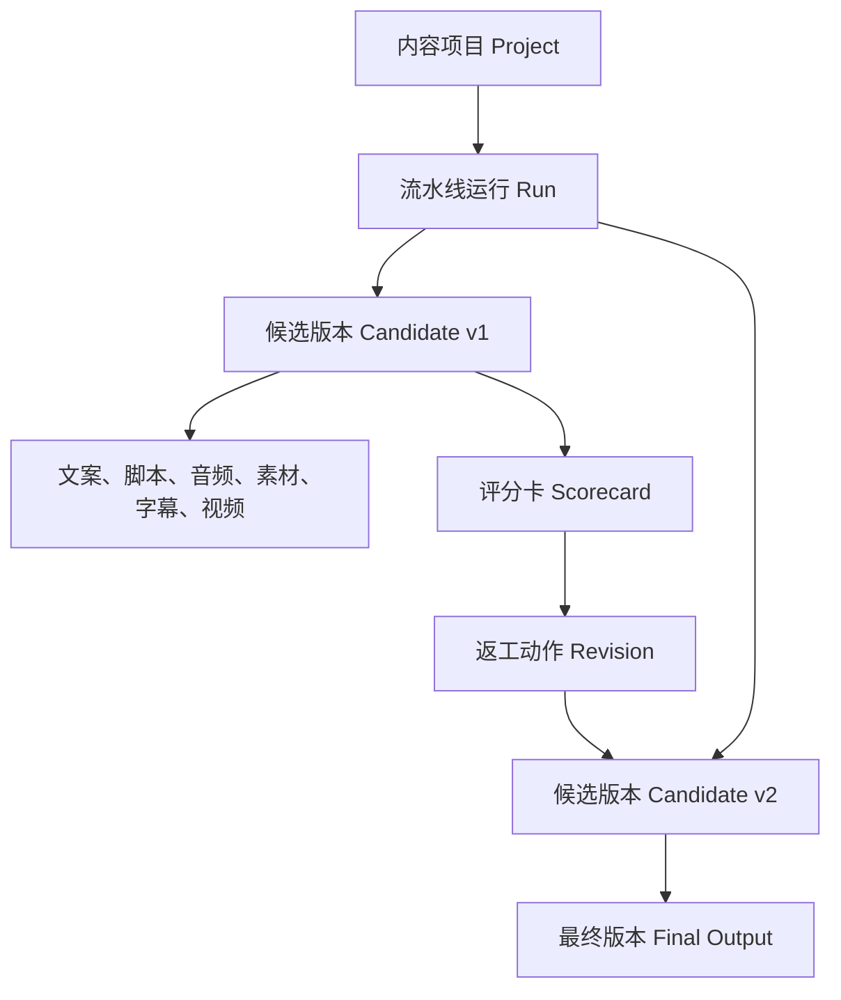
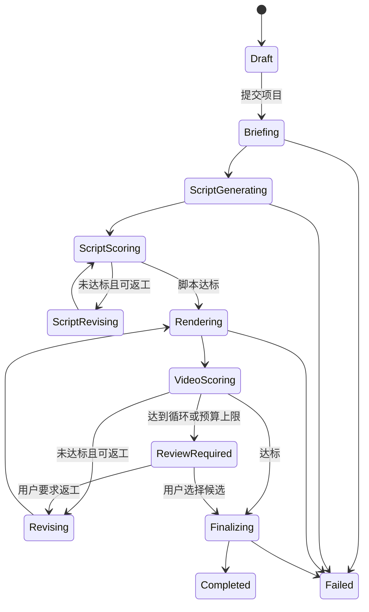
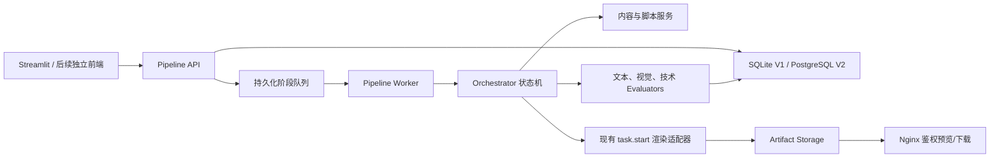

# 高质量 AI 视频生产流水线：产品—技术方案

> 状态：产品默认决策已通过 / Phase 1 已实现并部署 / Phase 2 待实施
>
> 目标版本：V1 方案
>
> 适用范围：MoneyPrinterTurbo SaaS，优先支持 9:16、30–90 秒中文短视频

## 1. 背景与目标

当前系统已经能完成“输入主题 → 生成文案和关键词 → 搜索素材 → 配音、字幕与合成 → 输出视频”，但本质上还是一次性生成工具。它缺少对中间产物的结构化管理，也无法回答以下问题：

- 这条文案为什么好或不好？
- 视频在钩子、叙事、画面匹配、节奏、声音等维度分别得多少分？
- 不合格时应该重写文案、替换素材，还是只重新合成？
- 多次返工中哪一版更好，成本增加了多少？
- 最终成片的质量结论和修改过程能否追溯？

本项目要把现有“视频生成器”升级成一个可评估、可返工、可追溯的 AI 视频生产系统：

```text
原始内容 → 内容简报 → 结构化脚本 → 视频候选 → 自动评分
                                  ↑              ↓
                                  └──── 定向返工 ──┘
                                                ↓
                                             最终产出
```

### 1.1 产品目标

1. 用户只需提交原始内容并选择内容类型，系统自动完成生产闭环。
2. 每个阶段都产出结构化数据，而不是只保留最终 MP4。
3. 每次评分都包含分数、证据、问题和明确返工建议。
4. 未达阈值时只返工有问题的环节，控制时间、API 成本和服务器内存。
5. 最终视频包含完整版本链路、质量报告和可下载产物。

### 1.2 V1 非目标

- 暂不做无限次数的全自动循环。
- 暂不做多台机器上的分布式并行渲染。
- 暂不以播放量直接训练或微调模型。
- 暂不同时覆盖长视频、横屏课程、直播切片等所有形态。
- 自动评分是生产决策辅助，不宣称等同于真实平台留存率。

## 2. 默认产品假设

为避免第一版范围失控，建议采用以下默认值：

| 项目 | V1 默认值 |
|---|---|
| 视频形态 | 9:16 竖屏短视频 |
| 视频时长 | 30–90 秒，推荐 45–60 秒 |
| 语言 | 中文 |
| 输入方式 | 主题 + 粘贴原始文本；URL 抓取放到后续版本 |
| 内容类型 | 励志、搞笑、反差 |
| 质量目标 | 综合分 ≥ 82，硬性门槛全部通过 |
| 最大返工次数 | 2 次，即最多生成 3 个候选版本 |
| 并发策略 | 单机串行生成候选，避免 2GB 服务器内存竞争 |
| 最终选择 | 达标即停止；均未达标时保留最高分版本并标记人工审核 |

## 3. 核心产品对象

现有的 `task_id` 代表一次视频生成。新流水线需要在它之上增加“项目”和“候选版本”两个层级：



### 3.1 对象定义

- `Project`：用户的一条内容生产需求，ID 在整个生命周期内不变。
- `Run`：Project 的一次完整生产运行，可由重新生成或配置变化触发。
- `Candidate`：一次具体候选版本，拥有独立 ID、父版本和版本号。
- `Artifact`：某阶段产生的文案、结构化脚本、音频、字幕、素材清单、视频等。
- `Scorecard`：对某个 Artifact 或 Candidate 的评分结果和证据。
- `Revision`：由评分问题转化出的定向返工指令。
- `Final Output`：最终被系统或用户选中的 Candidate。

## 4. 内容类型策略

内容类型不是简单标签，而是一组生成约束与专用评分规则。

### 4.1 励志

推荐结构：困境或共鸣 → 认知转折 → 具体行动 → 情绪抬升 → 余韵或号召。

重点指标：

- 前 3 秒是否建立痛点或强共鸣。
- 是否避免空泛口号，包含具体处境、动作或细节。
- 情绪曲线是否逐步上升，而不是全程同一强度。
- 结尾是否形成可记忆的一句话。

### 4.2 搞笑

推荐结构：建立预期 → 加强预期 → 错位或误导 → 包袱 → 回扣。

重点指标：

- 笑点是否来自明确的预期差，而非随机拼接。
- 铺垫是否足够短，包袱出现是否及时。
- 文案、画面和音效是否共同服务同一个笑点。
- 是否存在可删减的解释性句子。

### 4.3 反差

推荐结构：先展示 A → 强化用户预期 → 揭示 B → 对比证据 → 总结冲击。

重点指标：

- A 与 B 是否能够一句话说明，差异是否足够明显。
- 揭示发生前是否保留悬念。
- 画面是否真正展示对比，而不是只由旁白声称存在反差。
- 转折点是否有镜头、声音或字幕上的强调。

## 5. 端到端产品流程

### 5.1 创建项目

用户填写：

- 项目名称。
- 内容主题。
- 原始内容，可为空；为空时由主题扩写。
- 内容类型：励志、搞笑、反差。
- 目标受众。
- 目标时长。
- 必须包含、禁止出现的内容。
- 可选参考风格和补充要求。

### 5.2 生成内容简报

系统把自由文本标准化为 `ContentBrief`：

```json
{
  "topic": "普通人如何坚持长期主义",
  "theme": "motivational",
  "audience": "20-35 岁职场人",
  "core_message": "微小但持续的行动会形成复利",
  "angle": "用两个日常细节展示长期积累",
  "facts": [],
  "must_include": [],
  "must_avoid": [],
  "target_duration_seconds": 55,
  "emotion_curve": ["共鸣", "压抑", "转折", "振奋"],
  "call_to_action": "今天开始一个能坚持五分钟的行动"
}
```

内容简报是后续生成和评分的统一事实来源。修改简报会创建新的 Run，不直接覆盖历史版本。

### 5.3 生成结构化脚本

脚本不再只有一段旁白，而应同时描述时间、叙事功能和画面意图：

```json
{
  "title": "真正拉开差距的，不是某一次拼命",
  "hook": "你以为人与人的差距，是某一天突然拉开的？",
  "estimated_duration_seconds": 55,
  "scenes": [
    {
      "scene_no": 1,
      "start_seconds": 0,
      "end_seconds": 3,
      "beat_type": "hook",
      "narration": "你以为人与人的差距，是某一天突然拉开的？",
      "visual_intent": "两个人站在同一起点，随后出现时间流逝",
      "material_queries": ["two people starting line", "time lapse clock"],
      "subtitle_emphasis": ["差距", "突然"]
    }
  ]
}
```

现有纯旁白字段继续保留，由结构化脚本中的 `narration` 自动合并生成，以兼容现有配音和字幕流程。

### 5.4 阶段评分与生成

执行顺序：

1. 内容简报完整性检查。
2. 结构化脚本生成与脚本评分。
3. 脚本不达标时先返工脚本，避免提前消耗素材、TTS 和渲染资源。
4. 脚本达标后生成配音、字幕和素材。
5. 生成低成本预览候选并进行视频评分。
6. 按问题类型定向返工。
7. 达标后渲染最终 1080×1920 成片并再次做技术验收。

## 6. 评分体系

评分必须同时具备三个属性：

- `score`：0–100 分。
- `evidence`：指出具体文案、时间点、镜头或技术数据。
- `action`：可以被流水线执行的修改建议。

每项评分还应记录 `confidence`。低置信度结论只能建议人工审核，不能触发高成本返工。

### 6.1 Gate A：输入与简报检查

这是硬性门槛，不计入综合分：

- 主题、受众、核心表达不能为空。
- 目标时长合法。
- 原始内容与主题没有明显冲突。
- 必须包含与禁止内容不存在矛盾。
- 需要事实支撑的表达被标记为 `fact_check_required`。

### 6.2 Gate B：脚本质量评分

| 指标 | 权重 | 说明 |
|---|---:|---|
| 前 3 秒钩子 | 20% | 是否快速产生好奇、冲突、共鸣或利益点 |
| 主题类型匹配 | 15% | 是否符合励志、搞笑或反差的专用结构 |
| 叙事结构 | 15% | 起承转合、信息顺序和结尾是否完整 |
| 具体性与信息密度 | 15% | 是否有具体细节，是否存在空话和重复 |
| 情绪曲线 | 10% | 情绪是否有变化并在关键点达到峰值 |
| 口语与可配音性 | 10% | 句长、停顿、拗口表达是否适合朗读 |
| 画面可表达性 | 10% | 每句话能否找到或生成明确画面 |
| 合规与事实风险 | 5% | 是否包含高风险承诺、未经支持的事实等 |

建议通过线：总分 ≥ 80，并且“钩子、类型匹配、叙事结构”均不得低于 70。

### 6.3 Gate C：视频硬性技术检查

任一项失败都不能进入最终产出：

- MP4 可以正常解码且不是空文件。
- 分辨率、宽高比、帧率符合任务设置。
- 视频时长与旁白时长差值在允许范围内。
- 存在有效音轨，且没有长时间全静音。
- 不存在连续黑屏、冻结帧或损坏帧。
- 字幕启用时字幕文件存在，时间轴没有越界。
- 文件大小、码率处于合理区间。

### 6.4 Gate D：成片内容质量评分

| 指标 | 权重 | 说明 |
|---|---:|---|
| 脚本质量 | 25% | 继承 Gate B 的最终脚本评分 |
| 画面与旁白匹配 | 20% | 每个场景的画面是否支持对应表达 |
| 开头吸引力 | 15% | 前 3 秒声音、字幕、画面的组合效果 |
| 节奏与镜头变化 | 15% | 镜头长度、信息密度和转场是否合适 |
| 视觉质量与一致性 | 10% | 清晰度、构图、色彩、素材风格一致性 |
| 声音质量 | 8% | 人声清晰度、语速、音量与 BGM 平衡 |
| 字幕可读性 | 5% | 字号、对比度、断句、遮挡和同步 |
| 结尾完成度 | 2% | 是否自然收束并形成记忆点或行动引导 |

建议通过线：综合分 ≥ 82；画面匹配、开头吸引力不得低于 70；Gate C 必须全部通过。

### 6.5 评分实现原则

评分采用混合机制，不能让生成模型只凭主观印象给自己打分：

1. **确定性检测**：FFprobe/FFmpeg 检查编码、时长、音轨、黑屏、冻结帧和音量。
2. **文本评估模型**：评估内容简报和脚本，要求输出严格 JSON 及逐项证据。
3. **视觉评估模型**：按场景边界和固定间隔抽帧，将关键帧、旁白、画面意图一起评估。
4. **规则校验**：字数/秒、平均镜头长度、字幕行长、首个转折时间等。
5. **人工反馈**：用户可以覆盖评分、选择版本并记录理由，为后续优化规则积累数据。

## 7. Loop 定向返工策略

返工不是整条视频无脑重做，而是根据失败指标选择最小影响范围。

| 低分或失败项 | 返工动作 | 复用内容 |
|---|---|---|
| 钩子低分 | 只重写前 3–5 秒及与下一段的衔接 | 主体脚本、后续素材 |
| 类型匹配低分 | 按类型模板重组脚本节拍 | 原始内容、内容简报 |
| 文案空泛 | 增加事实、动作、场景和可视化细节 | 内容简报 |
| 画面匹配低分 | 重新生成对应场景查询词并替换该段素材 | 文案、音频、其它场景 |
| 节奏低分 | 调整镜头切点、素材顺序和片段长度 | 文案、配音、原素材池 |
| 人声低分 | 调整音色、语速、停顿或重新 TTS | 文案、素材 |
| BGM 失衡 | 只重新混音 | 视频轨、人声、字幕 |
| 字幕低分 | 重新断句、定位或样式渲染 | 视频轨、音频 |
| 技术硬门槛失败 | 使用原始中间产物重新合成 | 所有可用中间产物 |

循环控制：

- 默认最多返工 2 次。
- 单次返工后综合分提升不足 3 分时，不重复同一种返工动作。
- 预计成本超过项目预算时暂停并请求人工确认。
- 高风险事实、内容冲突和低置信度评分进入人工审核，不自动改写事实。
- 达标立即停止；未达标时选择历史最高分候选，不默认选择最后一次。

## 8. 状态机



状态变化必须写事件日志。Worker 重启后根据最后一个完成阶段和幂等键继续执行，不能依赖浏览器会话。

## 9. 技术架构

### 9.1 总体架构



### 9.2 代码边界建议

不要继续把逻辑堆入现有 `app/services/task.py`。建议新增独立领域模块：

```text
app/pipeline/
  domain.py                 # Project、Run、Candidate、Artifact、Scorecard
  policy.py                 # 阈值、预算、循环停止规则
  orchestrator.py           # 状态机与阶段调度
  repository.py             # 持久化接口
  sqlite_repository.py      # V1 SQLite 实现
  stages/
    brief.py
    script.py
    render.py               # 调用现有 task.start
    finalize.py
  evaluators/
    script_evaluator.py
    technical_evaluator.py
    visual_evaluator.py
  revisions/
    planner.py
    executors.py
```

现有服务的职责变化：

- `webui_task.py`：只负责提交 Project/Run，不承担流水线业务判断。
- `webui_worker.py`：领取阶段任务，执行 Orchestrator；继续与浏览器解耦。
- `task.py`：保留为“给定完整 VideoParams，产生一次视频候选”的渲染适配器。
- `state.py`：保留轻量运行状态；正式项目、版本和评分写独立表。

### 9.3 建议数据表

#### `content_projects`

- `project_id`
- `owner_id`，V1 可从 SSO 用户映射
- `title`
- `theme`
- `source_content`
- `status`
- `created_at` / `updated_at`

#### `pipeline_runs`

- `run_id`
- `project_id`
- `policy_snapshot_json`
- `brief_json`
- `status`
- `current_stage`
- `selected_candidate_id`
- `max_iterations`
- `cost_budget`
- `created_at` / `completed_at`

#### `candidates`

- `candidate_id`
- `run_id`
- `version`
- `parent_candidate_id`
- `render_task_id`
- `revision_reason`
- `status`
- `overall_score`
- `created_at`

#### `artifacts`

- `artifact_id`
- `candidate_id`
- `stage`
- `artifact_type`
- `path_or_uri`
- `content_hash`
- `metadata_json`
- `created_at`

#### `scorecards`

- `scorecard_id`
- `candidate_id`
- `stage`
- `evaluator`
- `evaluator_version`
- `overall_score`
- `passed`
- `dimensions_json`
- `evidence_json`
- `confidence`
- `created_at`

#### `pipeline_events`

- `event_id`
- `project_id` / `run_id` / `candidate_id`
- `stage`
- `event_type`
- `payload_json`
- `created_at`

### 9.4 Artifact 目录

```text
storage/projects/<project-id>/
  project.json
  runs/<run-id>/
    brief.json
    events.jsonl
    candidates/v1/
      script.json
      score-script.json
      audio.mp3
      subtitle.srt
      materials.json
      preview.mp4
      final.mp4
      score-video.json
    candidates/v2/
      ...
```

数据库保存可查询索引与状态，文件系统保存大产物和完整快照。JSON 文件采用临时文件写入后原子替换，防止断电产生半文件。

### 9.5 API 草案

- `POST /api/v1/projects`：创建内容项目。
- `GET /api/v1/projects`：项目列表和筛选。
- `GET /api/v1/projects/{project_id}`：项目、版本、评分和产物详情。
- `POST /api/v1/projects/{project_id}/runs`：启动一次流水线。
- `POST /api/v1/runs/{run_id}/pause`：在阶段边界暂停。
- `POST /api/v1/runs/{run_id}/resume`：继续运行。
- `POST /api/v1/runs/{run_id}/cancel`：取消尚未开始的阶段任务。
- `POST /api/v1/runs/{run_id}/candidates/{candidate_id}/select`：人工选择最终版本。
- `POST /api/v1/runs/{run_id}/revise`：提交人工返工要求。
- `GET /api/v1/runs/{run_id}/events`：查询进度和审计事件。

所有资源按 SSO 用户做权限检查；视频预览和下载继续通过 Nginx 鉴权路径提供。

## 10. Worker、幂等与故障恢复

V1 继续使用现有单机 Worker、SQLite 和文件队列，以适配当前 2GB 服务器。队列单位从“完整视频任务”细化为“阶段任务”。

每个阶段任务包含：

- `stage_job_id`
- `run_id`
- `candidate_id`
- `stage`
- `input_artifact_hashes`
- `attempt`
- `policy_snapshot`

幂等键建议为：

```text
run_id + candidate_id + stage + input_artifact_hashes + evaluator_version
```

故障恢复规则：

- 阶段开始前写 `started` 事件，产物原子落盘后写 `completed` 事件。
- Worker 重启后，只有缺少 `completed` 的阶段会重新执行。
- 已存在且 hash 匹配的 Artifact 直接复用。
- 外部 API 请求记录供应商请求 ID，能够避免时尽量避免重复扣费。
- 单个阶段失败采用指数退避；确定性错误不重试，直接进入失败或人工审核。

## 11. 2GB 服务器资源策略

1. 同一时间只允许一个视频渲染阶段运行。
2. 文案必须先过 Gate B，再启动 TTS、素材下载和 FFmpeg。
3. 视频评估先使用低分辨率预览和关键帧；达标后才输出 1080×1920 成片。
4. 抽帧逐批处理，不把整段视频或全部帧同时载入内存。
5. 返工时尽量复用音频、字幕和未变化场景的素材。
6. FFmpeg 显式限制线程数，Worker 保留 swap，但不能把 swap 当作常态内存。
7. 候选产物设置生命周期：最终版永久保留，未选版本可按配置在 7–30 天后清理。

## 12. SaaS 界面方案

### 12.1 创建页

- 原始内容输入区。
- 内容类型卡片：励志、搞笑、反差。
- 受众、时长、风格、高级限制。
- “生成高质量视频”主按钮。

### 12.2 项目详情页

- 顶部阶段 Stepper：内容 → 简报 → 脚本 → 视频 → 评分 → 返工 → 完成。
- 当前候选的综合分和门槛状态。
- 各维度雷达图或横向评分条。
- 具体证据：文案句子或视频时间点。
- 当前返工原因、正在重做的阶段和预计成本。
- 候选版本并排比较、预览和“设为最终版”。

### 12.3 历史项目列表

每张卡片展示：

- Project ID、主题、类型。
- 当前阶段和运行状态。
- 当前最高分、候选版本数和返工次数。
- 最终视频预览/下载。
- “查看质量报告”“继续返工”“基于此项目创建副本”。

## 13. 日志、成本与可观测性

所有日志至少包含 `project_id`、`run_id`、`candidate_id`、`stage_job_id`。

需要记录：

- 每阶段开始、结束、耗时和重试次数。
- LLM/TTS/素材/视觉模型供应商与模型版本。
- Token、API 调用次数、下载流量和估算成本。
- 评分器版本、输入 Artifact hash 和输出 Scorecard。
- 每次返工前后的分数变化。
- 最终选择由系统还是用户做出。

关键运营指标：

- 首次生成达标率。
- 平均返工次数。
- 各评分维度的失败分布。
- 平均生成时长和单条估算成本。
- 自动选择版本被用户覆盖的比例。
- 最终产出成功率。

## 14. 安全与质量风险

- 原始内容可能包含提示注入，必须作为数据引用，不能覆盖系统评分规则。
- 自动改写事实可能制造错误；事实相关修改要保留原始证据并标记审核。
- 同一个模型生成并评分可能产生偏见；生成器与评估器应使用不同提示词，后续可使用不同模型。
- 视觉模型对幽默、文化语境和情绪的判断可能不稳定，因此必须输出证据和置信度。
- 评分器、Prompt 和权重需要版本化，否则历史分数不可比较。
- 自动循环必须受次数、成本和时间三重预算限制。

## 15. 分阶段交付计划

### Phase 1：项目数据与脚本质量闭环

- Project/Run/Candidate/Artifact/Scorecard 数据模型。
- 励志、搞笑、反差三类 ContentBrief 和结构化脚本。
- Gate A、Gate B。
- 脚本低分后的定向改写，最多两次。
- 项目详情展示脚本版本、评分和修改原因。

验收：不生成视频也能完成“原始内容 → 脚本 → 评分 → 返工 → 达标脚本”的完整闭环。

### Phase 2：候选视频与技术评分

- 将现有 `task.start` 适配为 Candidate 渲染阶段。
- Gate C 硬性检测。
- 低分辨率预览候选。
- 项目、候选、原有 render task 的关联。
- 浏览器关闭和 Worker 重启恢复。

验收：生成候选后有可追溯的技术报告，技术失败可复用中间产物重新合成。

### Phase 3：多模态内容评分与定向返工

- 场景关键帧抽取。
- Gate D 画面匹配、开头、节奏、声音、字幕评分。
- 评分到返工动作的 Revision Planner。
- 局部素材替换、节奏调整、重新混音、字幕重渲染。
- 候选版本比较和自动选优。

验收：不达标候选能说明具体问题，并只重做对应环节；每次返工前后分数可比较。

### Phase 4：真实效果反馈

- 用户人工评分与选择原因。
- 发布平台数据回流：3 秒留存、完播率、互动率等。
- 自动评分与真实表现的相关性分析。
- 按内容类型校准权重与阈值。

验收：评分体系不只依赖模型判断，能够用真实数据持续校准。

## 16. V1 完整验收标准

- 用户可从主题和原始文本创建项目，并选择励志、搞笑或反差。
- 系统生成 ContentBrief 和结构化脚本。
- 脚本评分不达标时能够自动返工，且保留各版本和修改依据。
- 达标脚本可以进入现有视频渲染流程。
- 成片必须通过技术硬门槛和内容质量评分。
- 不达标成片最多定向返工两次，不进行无限循环。
- 最终输出包含视频、脚本、素材清单、评分卡和版本链路。
- 关闭网页不会中断运行；Worker 重启可从阶段边界恢复。
- 所有阶段都有 ID、结构化事件、持久化日志和成本记录。
- 用户可以人工选择任一候选作为最终版本。

## 17. 已确认产品决策

本轮采用方案中的推荐默认值：

1. V1 限定为 9:16、30–90 秒中文短视频。
2. 原始内容先支持主题和粘贴文本，URL、文件、公众号文章后置。
3. 默认采用脚本 80 分、成片 82 分、最多返工 2 次。
4. 先交付“脚本质量闭环”，再接多模态成片评分。
5. 达到循环或预算上限仍未达标时进入人工审核，由用户选择最高分候选或继续返工。

## 18. 工程组织决策

### 18.1 推荐结论

V1 在当前 MoneyPrinterTurbo 仓库内建设，不新建独立工程。新增 `app/pipeline/` 作为一个 deep Pipeline module，通过一个稳定 interface 隐藏项目状态机、评分、返工、版本和 Artifact 管理。

现有 `app/services/task.py` 继续作为视频 Candidate 的渲染 adapter。Pipeline module 调用它生成候选，不复制素材搜索、TTS、字幕、FFmpeg、发布和任务日志实现。

这样做的原因：

- 现阶段只有一个真实渲染实现，立即拆仓库只会制造假设性的远程 seam。
- 现有 Worker、SQLite、文件存储、Nginx 下载和 SSO 可以直接复用。
- 单仓库内可以对 Project、Candidate 和 render task 做原子状态更新。
- 当前 2GB 单机无需额外常驻进程、远程调用和第二套数据库连接池。
- 测试可以直接使用现有渲染 adapter 的 in-memory fake，不需要启动两套工程。

### 18.2 代码组织

第一阶段保持单仓库、单部署，但代码必须按领域拆分：

```text
MoneyPrinterTurbo/
  app/
    pipeline/                 # 新增：项目生产流水线
      domain.py
      orchestrator.py
      policy.py
      repository.py
      sqlite_repository.py
      stages/
      evaluators/
      revisions/
    services/                 # 现有生成能力
      task.py                 # Candidate 渲染 adapter
      webui_worker.py         # 后台阶段执行
  webui/
    Main.py                   # 第一阶段继续复用现有 SaaS 页面
```

Pipeline module 的外部 interface 只暴露以下产品动作：创建项目、启动 Run、查询项目、暂停/继续、提交人工返工、选择最终 Candidate。阶段顺序、重试、评分公式和文件布局全部属于 implementation，不能泄漏到 WebUI 或 Worker 调用方。

### 18.3 将来拆成独立工程的触发条件

满足以下任意两个条件后，再评估从当前仓库提取独立 Pipeline 工程：

- 出现第二个真实渲染 adapter，例如另一套视频生成引擎。
- 需要多机 Worker、独立扩缩容或 GPU 节点。
- Pipeline 与渲染引擎由不同团队维护并采用独立发布周期。
- 数据从 SQLite 和本地文件迁移到 PostgreSQL、消息队列和对象存储。
- 除 MoneyPrinterTurbo 外，还有其它产品需要调用同一条 Pipeline。

在提取前，先稳定 Pipeline interface 和领域模型。未来独立工程只替换 adapter，不改 Project/Run/Candidate 的产品语义。
